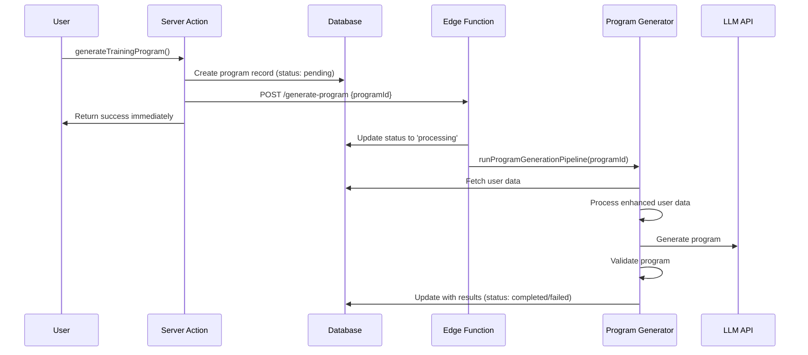

# Training Program Background Generation Architecture

## Overview

This document outlines the implementation of a new background program generation architecture that moves the heavy computational work from synchronous server actions to asynchronous background processing via Supabase Edge Functions.

## Architecture Components

### 1. Database Migration (`supabase/migrations/20250801125658_add_generation_status_to_training_programs.sql`)

**Purpose**: Adds status tracking columns to the `training_programs` table.

**Changes**:
- Added `generation_status` column with CHECK constraint for values: `pending`, `processing`, `completed`, `failed`
- Added `generation_error` TEXT column for error messages
- Added indexes for efficient status querying

**Benefits**:
- Enables tracking of background generation progress
- Allows users to see generation status in real-time
- Provides error handling and debugging capabilities

### 2. Shared Library (`src/lib/ai/programGenerator.ts`)

**Purpose**: Contains the core program generation logic extracted from the original server action.

**Key Function**: `runProgramGenerationPipeline(programId: string)`

**Responsibilities**:
- Fetches user profile and onboarding data
- Processes enhanced user data through scientific analysis modules
- Calls the LLM API with retry logic and progressive complexity fallback
- Validates the generated program (enhanced + basic fallback)
- Updates the database record with results or error status

**Benefits**:
- Reusable across different execution contexts (server actions, Edge Functions)
- Centralized program generation logic
- Proper error handling and status updates

### 3. Supabase Edge Function (`supabase/functions/generate-program/index.ts`)

**Purpose**: HTTP-triggered function that runs the program generation pipeline in the background.

**Key Features**:
- Accepts POST requests with `programId` in the body
- Authenticates users via JWT tokens
- Verifies user ownership of the program
- Prevents duplicate processing
- Returns 202 Accepted immediately while processing continues

**Security**:
- Validates authentication tokens
- Enforces ownership checks
- Rate limiting through generation status checks

### 4. Refactored Server Action (`src/app/_actions/aiProgramActions.ts`)

**Purpose**: Lightweight trigger that creates database entries and initiates background processing.

**New Flow**:
1. Authenticate user
2. Check subscription status
3. Create training program record with `pending` status
4. Call Edge Function with program ID
5. Return success immediately

**Benefits**:
- Fast response times (no waiting for generation)
- Better user experience with immediate feedback
- Scalable architecture for heavy workloads

## Data Flow

## Benefits of the New Architecture

### 1. Performance
- **Immediate Response**: Users get instant feedback instead of waiting 30-60 seconds
- **Non-blocking**: Web interface remains responsive during generation
- **Scalable**: Can handle multiple concurrent generations

### 2. User Experience
- **Progressive Status**: Users can see generation progress
- **Reliability**: Failures are tracked and can be retried
- **Transparency**: Clear error messages when issues occur

### 3. Technical Benefits
- **Separation of Concerns**: UI logic separated from heavy computation
- **Maintainability**: Centralized generation logic
- **Testability**: Components can be tested independently
- **Error Handling**: Comprehensive error tracking and recovery

### 4. Infrastructure Benefits
- **Resource Optimization**: Edge Functions can be scaled independently
- **Cost Efficiency**: Only pay for compute when generating programs
- **Monitoring**: Better observability of generation processes

## Migration Strategy

### Phase 1: Database Schema Update
1. Run the migration to add status columns
2. Update existing records to have `completed` status
3. Verify indexes are created

### Phase 2: Deploy New Code
1. Deploy shared library
2. Deploy Edge Function
3. Deploy updated server action
4. Update frontend to handle new response format

### Phase 3: Monitoring and Optimization
1. Monitor generation success rates
2. Track average generation times
3. Optimize retry logic and error handling
4. Add user notifications for completion

## Frontend Integration

The frontend should be updated to:

1. **Handle Immediate Response**: Show "Generation started" message
2. **Poll for Status**: Periodically check generation status
3. **Display Progress**: Show current status to user
4. **Handle Completion**: Redirect to program when ready
5. **Error Recovery**: Allow retry on failures

## Environment Variables

Ensure these environment variables are set:

- `NEXT_PUBLIC_SUPABASE_URL`: Supabase project URL
- `SUPABASE_SERVICE_ROLE_KEY`: Service role key for Edge Function

## Testing Strategy

### Unit Tests
- Test `runProgramGenerationPipeline` with various input scenarios
- Test Edge Function authentication and validation
- Test server action flow and error handling

### Integration Tests
- End-to-end generation flow
- Error scenarios and recovery
- Concurrent generation handling

### Performance Tests
- Load testing with multiple concurrent generations
- Memory usage monitoring in Edge Functions
- Database performance under load

## Future Enhancements

1. **Queue System**: Implement Redis/PostgreSQL queue for better job management
2. **Progress Updates**: Real-time progress notifications via WebSockets
3. **Priority Queues**: Different priority levels for different user tiers
4. **Batch Generation**: Generate multiple programs efficiently
5. **Caching**: Intelligent caching of similar program requests

## Security Considerations

1. **Authentication**: All endpoints require valid JWT tokens
2. **Authorization**: Users can only generate their own programs
3. **Rate Limiting**: Prevent abuse through status checks
4. **Input Validation**: Sanitize all user inputs
5. **Error Information**: Don't leak sensitive data in error messages

## Monitoring and Observability

Key metrics to track:

1. **Generation Success Rate**: Percentage of successful generations
2. **Average Generation Time**: Time from trigger to completion
3. **Error Rates**: Types and frequency of failures
4. **User Experience**: Time from request to program delivery
5. **Resource Usage**: Edge Function execution time and memory

This architecture provides a robust, scalable foundation for training program generation that can grow with the application's needs while providing an excellent user experience.