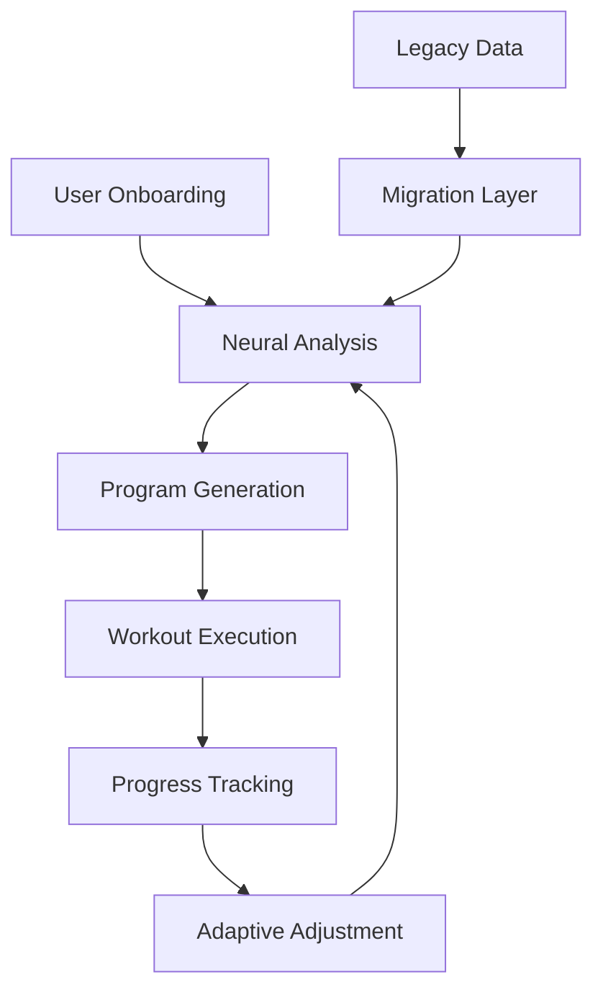

# Neural Type System Implementation Plan

## Overview

The Neural Type System is a comprehensive replacement for the complex Phoenix schema-based program generation functionality. It provides a simplified, flexible, and AI-driven approach to fitness program creation and management.

## Architecture Decision

**Problem**: The previous Phoenix schema system was overly complex, causing frequent Zod validation failures and making the AI program generation unreliable.

**Solution**: Implement a simplified "Neural" type system that:
- Reduces complexity while maintaining functionality
- Provides clear, intuitive interfaces
- Supports progressive enhancement and adaptive programming
- Maintains backward compatibility during migration

## Core Components

### 1. Type Definitions (`src/types/neural.ts`)

#### Primary Interfaces

1. **OnboardingData**: Simplified user preference collection
2. **Exercise**: Individual exercise definition with practical fields
3. **Workout**: Complete workout session structure
4. **TrainingProgram**: Neural-generated training program
5. **ProgressData**: Progress tracking for adaptive programming
6. **NeuralRequest/Response**: API communication interfaces

#### Key Design Principles

- **Simplicity**: Flat structure over deeply nested hierarchies
- **Flexibility**: String-based fields for natural language descriptions
- **Extensibility**: Optional fields for progressive enhancement
- **Type Safety**: Strong TypeScript typing with runtime validation

### 2. Validation Layer (`src/lib/validation/enhancedProgramSchema.ts`)

#### Dual Validation Support

- **Neural Schemas**: Zod validation for new Neural types
- **Legacy Schemas**: Backward compatibility for existing program types
- **Auto-Detection**: Automatic type detection and validation
- **Migration Utilities**: Helpers for transitioning between systems

#### Validation Features

- Runtime type checking with detailed error messages
- Flexible validation that allows AI creativity
- Progressive validation (optional fields)
- Type guards for runtime safety

### 3. Backward Compatibility (`src/lib/types/program.ts`)

#### Legacy Type Support

- Maintains existing import paths
- Provides stub implementations for removed functionality
- Enables gradual migration without breaking changes
- Includes conversion utilities

## Implementation Strategy

### Phase 1: Foundation (Completed)
- ✅ Create Neural type definitions
- ✅ Implement validation schemas
- ✅ Add backward compatibility layer
- ✅ Update API response schemas

### Phase 2: Integration (Next Steps)
- [ ] Update program generation endpoints to use Neural types
- [ ] Implement Neural-based AI coach functionality
- [ ] Create migration utilities for existing data
- [ ] Add comprehensive tests

### Phase 3: Enhancement (Future)
- [ ] Add real-time adaptive programming
- [ ] Implement machine learning-based recommendations
- [ ] Create advanced progress tracking
- [ ] Add social features and community integration

## API Design

### Neural Program Generation

```typescript
// Request
interface NeuralRequest {
  onboardingData: OnboardingData;
  currentWeek: number;
  previousProgress?: ProgressData;
}

// Response
interface NeuralResponse {
  program: TrainingProgram;
  reasoning: string;
  progressionPlan: string;
  nextWeekPreview: string;
}
```

### Key Improvements Over Legacy System

1. **Simplified Structure**: Single-level arrays instead of nested hierarchies
2. **Natural Language**: String-based descriptions instead of rigid enums
3. **AI-Friendly**: Designed for LLM generation with flexible validation
4. **Progressive**: Optional fields allow for basic → advanced functionality
5. **Adaptive**: Built-in support for progress tracking and adaptation

## Data Flow



## Migration Strategy

### For Existing Code

1. **Immediate**: Legacy types remain functional via compatibility layer
2. **Gradual**: Convert components one-by-one to Neural types
3. **Optional**: Can run both systems in parallel during transition
4. **Safe**: No breaking changes to existing functionality

### For Database

1. **Additive**: New Neural program tables alongside existing
2. **Dual Write**: Write to both formats during transition
3. **Eventual**: Migrate fully to Neural format over time
4. **Recoverable**: Always maintain ability to rollback

## Benefits

### For Users
- More reliable program generation
- Better AI coaching experience
- Adaptive programming based on progress
- Clearer exercise instructions and guidance

### For Developers
- Simpler type system to work with
- Reduced validation complexity
- Better AI integration capabilities
- Easier testing and debugging

### For AI Integration
- More flexible schema for LLM generation
- Natural language support
- Adaptive learning capabilities
- Easier prompt engineering

## Testing Strategy

### Unit Tests
- Type validation tests
- Conversion utility tests
- Helper function tests
- Edge case handling

### Integration Tests
- API endpoint testing
- Database migration testing
- AI generation testing
- Progress tracking testing

### End-to-End Tests
- Complete user journey testing
- Program generation reliability
- Adaptive programming scenarios
- Migration path validation

## Performance Considerations

### Validation Performance
- Zod schemas optimized for speed
- Cached validation results where appropriate
- Lazy validation for optional fields
- Batch validation for arrays

### Memory Usage
- Flatter structure reduces memory overhead
- Optional fields reduce base object size
- Efficient serialization/deserialization
- Garbage collection friendly

## Security Considerations

### Input Validation
- All user inputs validated against schemas
- Sanitization of string fields
- Range validation for numeric fields
- Length limits on text fields

### Data Privacy
- User progress data encrypted at rest
- Personal records anonymized in analytics
- GDPR compliance for data export/deletion
- Audit trail for sensitive operations

## Monitoring and Observability

### Metrics to Track
- Program generation success rate
- Validation failure rates
- User engagement with generated programs
- Progress tracking accuracy

### Logging Strategy
- Structured logging for all Neural operations
- Error tracking for validation failures
- Performance metrics for AI generation
- User behavior analytics

## Future Enhancements

### Advanced AI Features
- Multi-week program planning
- Real-time exercise form feedback
- Injury prevention algorithms
- Social comparison and motivation

### Integration Possibilities
- Wearable device integration
- Nutrition tracking correlation
- Sleep and recovery integration
- Professional trainer collaboration

## Conclusion

The Neural Type System represents a significant architectural improvement that:

1. **Solves Current Problems**: Eliminates validation failures and complexity
2. **Enables Future Growth**: Provides foundation for advanced AI features
3. **Maintains Compatibility**: Ensures smooth transition from legacy system
4. **Improves User Experience**: More reliable and personalized training programs

This implementation provides immediate stability improvements while laying the groundwork for next-generation fitness AI capabilities.
